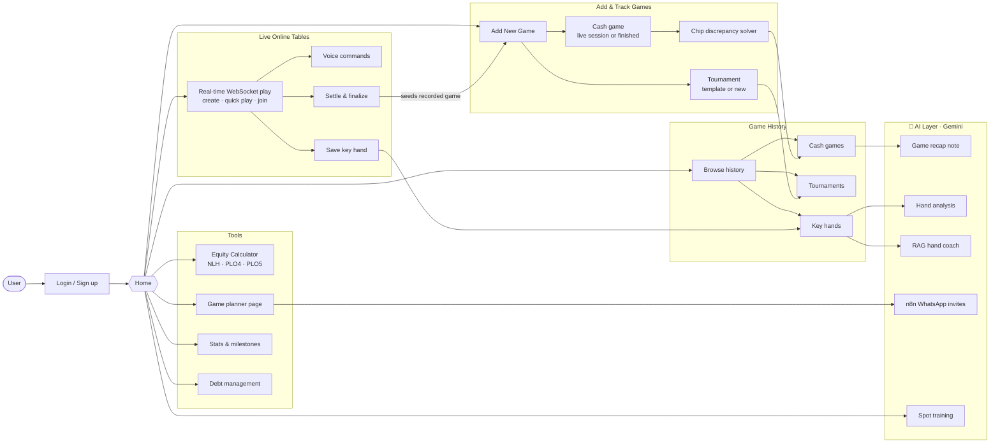

# Poker Solver: Final Project

## Project description (AI Engineering course)

Poker Solver is a full-stack poker app (React + FastAPI + MongoDB) focused first on real game flow: players can host real-time online multiplayer tables over WebSockets, manage live sessions, track cash games, tournaments, debts, solve chip discrepancies, and view per-player statistics in one place. On top of the live-play system it adds poker tools such as equity simulations and saved hand analysis, with an AI layer built on Google Gemini that works with the hands played inside the app, generating persona-driven game recaps and providing street-by-street coaching on saved hands using RAG, grading each hero decision and identifying the biggest leak in the hand. The goal is a complete poker app built from a real player's perspective, combining game flow, player tracking, session management, and AI-based strategic analysis into one system.

## Mermaid diagram: `mermaid_final`

Main app flow, left to right.

