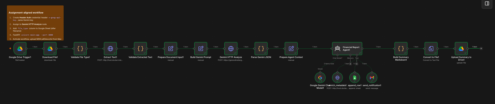
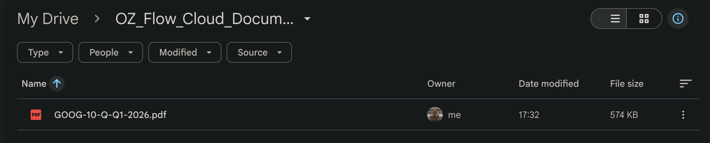
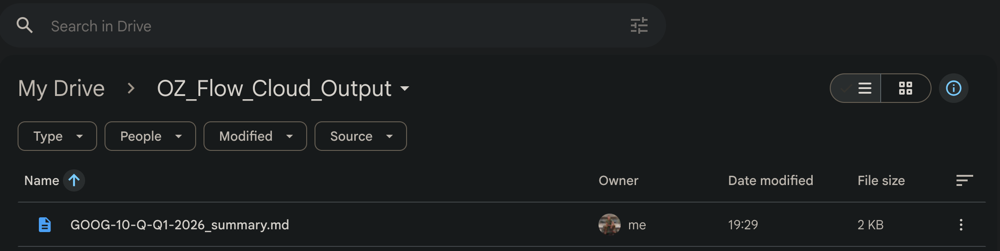
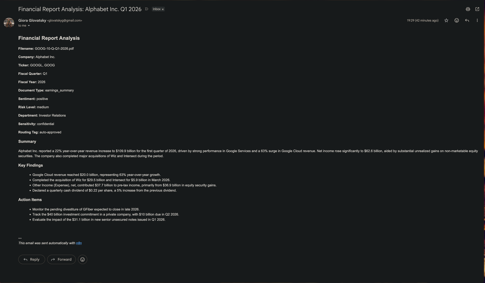

# Financial Report Analyst

**Topic:** #19 Financial reports — earnings summaries, budget proposals, expense reports

Automated pipeline that watches Google Drive for quarterly financial reports (**PDF, DOCX, TXT**), extracts text via FastAPI, analyzes with **Gemini** (HTTP Request + AI Agent), enriches via a Metadata API, logs to Google Sheets, uploads a summary file to Drive, and sends an AI-generated Gmail notification.

Built with **n8n**, **Google Gemini**, **FastAPI**, **Google Sheets**, and **Gmail**.

---

## Setup

Follow these steps after cloning the repository.

### Prerequisites

- **Python 3.11+**
- **Docker** (to run n8n)
- **Google account** with access to Drive, Sheets, and Gmail
- **Gemini API key** from [Google AI Studio](https://aistudio.google.com/apikey)

### 1. Clone and install dependencies

```bash
git clone <your-repo-url>
cd new_hw_n8n

python3 -m venv .venv
source .venv/bin/activate   # Windows: .venv\Scripts\activate
pip install -r requirements.txt
```

### 2. Create `.env`

The `.env` file is not committed. Create it in the project root:

```bash
echo 'GEMINI_API_KEY=your_key_here' > .env
```

You will use the same key in n8n credentials (see step 7).

### 3. Prepare Google resources

Create these in your Google account (or reuse existing folders/sheet):

| Resource | Suggested name | Used for |
|----------|----------------|----------|
| Drive folder | `OZ_Flow_Cloud_Document_Analyst/` | Input — drop PDF/DOCX/TXT here |
| Drive folder | `OZ_Flow_Cloud_Output/` | Output — summary `.md` files |
| Google Sheet | `Financial Reports Analysis` | One row per processed report |

**Sheet header row** (24 columns, in this order):

```text
document_id, filename, file_type, company, ticker, fiscal_quarter, fiscal_year,
report_date, document_type, revenue, net_income, eps, expenses, guidance,
sentiment, risk_level, department, routing_tag, sensitivity, confidence_score,
summary, key_findings, action_items, processed_at
```

Copy the folder and sheet IDs from the URL — you will need them in step 8.

### 4. Start FastAPI

From the project root (with venv active):

```bash
uvicorn main:app --reload --port 8000
```

Verify: http://localhost:8000/health should return `{"status":"ok"}`.

Keep this running. n8n (in Docker) calls the API at `http://host.docker.internal:8000`.

> **Linux:** If `host.docker.internal` does not resolve from Docker, add `--add-host=host.docker.internal:host-gateway` to your n8n `docker run` command, or change the URLs in **Extract Text1** and **enrich_metadata1** to your host IP.

### 5. Start n8n

Run n8n in Docker (adjust volume/port flags to your preference):

```bash
docker run -d --name n8n \
  -p 5678:5678 \
  -v n8n_data:/home/node/.n8n \
  n8nio/n8n
```

Open http://localhost:5678 and complete the n8n first-time setup.

### 6. Import the workflow

1. In n8n: **Workflows** → **Import from File**
2. Select [`financial_report_workflow.json`](financial_report_workflow.json)
3. Open the imported **Financial Report Analyst** workflow

### 7. Add n8n credentials

Create and assign these credentials in n8n:

| Credential type | Settings | Used by |
|-----------------|----------|---------|
| **Header Auth** | Header name: `x-goog-api-key`, Value: your Gemini API key | Gemini HTTP Analyze |
| **Google Gemini(PaLM) API** | API key: same Gemini key | Google Gemini Chat Model1 |
| **Google Drive OAuth2** | Connect your Google account | Trigger, Download, Upload nodes |
| **Google Sheets OAuth2** | Connect your Google account | append_row1 |
| **Gmail OAuth2** | Connect your Google account | send_notification1 |

For **Header Auth**, the header name must be exactly `x-goog-api-key` — not the credential display name.

### 8. Configure workflow nodes

After import, re-select your own Google resources (IDs from step 3 are user-specific):

| Node | What to set |
|------|-------------|
| **Google Drive Trigger1** | Input folder → your `OZ_Flow_Cloud_Document_Analyst` folder |
| **Prepare Document Input1** | `notification_email` → your Gmail address |
| **append_row1** | Spreadsheet → your **Financial Reports Analysis** sheet |
| **Upload Summary to Drive1** | Folder → your `OZ_Flow_Cloud_Output` folder |

The exported workflow may still point to the original author's folder/sheet IDs — you must replace them with your own.

### 9. Publish and test

1. Toggle the workflow **Active** (published). It will poll Drive **every minute** for new uploads.
2. Upload a **new** PDF, DOCX, or TXT file to the input folder (upload from your computer; moving files inside Drive may not trigger).
3. Wait ~1 minute, then check:
   - n8n **Executions** tab
   - Google Sheet (new row)
   - Output folder (`.md` summary)
   - Gmail inbox

---

## How the workflow runs (published + polling)

The workflow is **published (Active)** in n8n. Once active, it runs continuously in the background.

The **Google Drive Trigger** polls the input folder **`OZ_Flow_Cloud_Document_Analyst`** every **1 minute** (`everyMinute`). On each poll, n8n checks whether any **new files** were created in that folder since the last check. When a new PDF, DOCX, or TXT file appears, the full pipeline runs automatically.

Important:

- The workflow must stay **Active** (published) — manual "Test workflow" is not the same as production polling.
- Upload **new files directly** from your computer into the watched folder (moving/copying inside Drive may not trigger).
- After activating, wait at least one poll cycle (~1 minute) before testing.

---

## What the workflow does (summary)

1. Detects a new file in Google Drive
2. Downloads and validates the file type
3. Extracts text via FastAPI
4. Sends text to **Gemini HTTP Request** for structured JSON analysis
5. **AI Agent** calls tools using that analysis: enrich metadata, append to Sheets, send Gmail
6. Builds a Markdown summary and uploads it to **`OZ_Flow_Cloud_Output`**

---

## Screenshots

Example run processing a Google 10-Q report (`GOOG-10-Q-Q1-2026.pdf`):

**n8n — successful execution.** All workflow nodes completed after a new file was detected in Drive.



**Google Drive — input folder.** The original report uploaded to `OZ_Flow_Cloud_Document_Analyst/`.



**Google Drive — output folder.** Generated Markdown summary saved to `OZ_Flow_Cloud_Output/`.



**Gmail — notification.** AI-generated email with company, sentiment, and summary.



**Google Sheets — logged row.** The Agent appends one row per report with all 24 columns. Sample output for the same run: [`pictures/sheets_snippet.csv`](pictures/sheets_snippet.csv).

| company | ticker | fiscal_quarter | document_type | sentiment | risk_level | sensitivity |
|---------|--------|----------------|---------------|-----------|------------|-------------|
| Alphabet Inc. | GOOGL, GOOG | Q1 2026 | earnings_summary | positive | medium | confidential |

A sample summary file is also included at [`pictures/GOOG-10-Q-Q1-2026_summary.md`](pictures/GOOG-10-Q-Q1-2026_summary.md).

---

## Architecture

```text
Google Drive Trigger (everyMinute, published)
    ↓
Download File → Validate File Type → Extract Text → Validate Extracted Text
    ↓
Prepare Document Input
    ↓
Build Gemini Prompt → Gemini HTTP Analyze → Parse Gemini JSON → Prepare Agent Context
    ↓
Financial Report Agent
    ├── Google Gemini Chat Model (LLM)
    ├── enrich_metadata   → POST /enrich
    ├── append_row        → Google Sheets
    └── send_notification → Gmail
    ↓
Build Summary Markdown → Convert to File → Upload Summary to Drive
```

---

## n8n workflow — every node explained

The workflow is defined in [`financial_report_workflow.json`](financial_report_workflow.json).

### Trigger and file intake

| Node | Type | What it does |
|------|------|--------------|
| **Google Drive Trigger1** | Trigger | Polls `OZ_Flow_Cloud_Document_Analyst` every minute for newly created files. Starts the workflow when a new upload is detected. |
| **Download File1** | Google Drive | Downloads the triggered file as binary data using its Drive file ID. |
| **Validate File Type1** | Code | Rejects files that are not `.pdf`, `.docx`, or `.txt`. Stops the run with a clear error for unsupported types. |
| **Extract Text1** | HTTP Request | Sends the file to FastAPI `POST /extract` at `host.docker.internal:8000`. Returns plain text from PDF/DOCX/TXT. |
| **Validate Extracted Text** | Code | Fails if extracted text is empty or too short (e.g. scanned/image-only PDFs). |
| **Prepare Document Input1** | Set | Prepares `filename`, `extracted_text`, `notification_email`, and `file_type` (extension) for downstream nodes. |

### Gemini analysis (HTTP — assignment pattern)

| Node | Type | What it does |
|------|------|--------------|
| **Build Gemini Prompt** | Set | Builds the full financial-analysis prompt with the extracted document text and assignment JSON schema. |
| **Gemini HTTP Analyze** | HTTP Request | Calls Gemini Flash API (`gemini-3-flash-preview`) with structured JSON output. Uses **Header Auth** credential (`x-goog-api-key`). |
| **Parse Gemini JSON** | Code | Parses Gemini's response into a clean JSON object (company, metrics, sentiment, risks, etc.). |
| **Prepare Agent Context** | Set | Packages `analysis_json`, `filename`, `file_type`, and `notification_email` for the AI Agent. |

### AI Agent and tools

| Node | Type | What it does |
|------|------|--------------|
| **Financial Report Agent1** | AI Agent | Receives pre-computed `analysis_json`. Calls tools in order: enrich → Sheets → Gmail. Returns final JSON summary. Does not re-analyze the document from scratch. |
| **Google Gemini Chat Model1** | LLM (sub-node) | Provides the language model for the Agent (tool calling). Uses **Google Gemini(PaLM) API** credential. Can use `gemini-pro-latest` if preview models crash. |
| **enrich_metadata1** | HTTP Request Tool | Agent tool. POSTs analysis fields to FastAPI `/enrich`. Returns `document_id`, `department`, `routing_tag`, `sensitivity`, `processed_at`. |
| **append_row1** | Google Sheets Tool | Agent tool. Appends one row to **Financial Reports Analysis** sheet with all 24 columns including `file_type`. |
| **send_notification1** | Gmail Tool | Agent tool. Sends an **AI-generated** HTML email with required fields (company, sentiment, summary, etc.) to the notification address. |

### Output

| Node | Type | What it does |
|------|------|--------------|
| **Build Summary Markdown1** | Code | Builds a readable `.md` report from the Agent's final JSON (company, metrics, findings, risks, action items). Supports nested `financial_metrics`. |
| **Convert to File1** | Convert to File | Converts the Markdown string into a binary file named `{original}_summary.md`. |
| **Upload Summary to Drive1** | Google Drive | Uploads the summary file to **`OZ_Flow_Cloud_Output`**. |

---

## Google Drive folders

| Folder | Purpose |
|--------|---------|
| `OZ_Flow_Cloud_Document_Analyst/` | Drop earnings reports here (workflow watches this folder) |
| `OZ_Flow_Cloud_Output/` | Processed summary `.md` files are saved here |

---

## Supported file types

| Extension | Extracted by |
|-----------|--------------|
| `.pdf` | PyMuPDF via FastAPI `/extract` |
| `.docx` | python-docx via FastAPI `/extract` |
| `.txt` | Direct read via FastAPI `/extract` |

---

## How Gemini is used

| Component | Role | Typical model |
|-----------|------|---------------|
| **Gemini HTTP Analyze** | Structured financial JSON analysis (assignment HTTP Request pattern) | `gemini-3-flash-preview` |
| **Google Gemini Chat Model** | Agent tool orchestration (enrich, Sheets, Gmail) | `gemini-pro-latest` or Flash |

The assignment describes calling Gemini through an HTTP Request node. This project uses **HTTP Request for analysis** plus **Gemini Chat Model inside an AI Agent** for tool calls — both satisfy the Gemini integration requirement.

---

## API key storage

| Credential | Header / type | Used by |
|------------|---------------|---------|
| **Header Auth** | `x-goog-api-key` | Gemini HTTP Analyze |
| **Google Gemini(PaLM) API** | API key | Google Gemini Chat Model |

Use the same Gemini API key from `.env` for both. **Never hardcode keys** in the workflow JSON.

---

## FastAPI service

Run locally (see [Setup](#setup) step 4). n8n in Docker reaches it at `http://host.docker.internal:8000`.

| Method | Path | Description |
|--------|------|-------------|
| GET | `/health` | Health check |
| GET | `/categories` | Document type categories |
| POST | `/sensitivity` | Classify public / internal / confidential |
| POST | `/enrich` | Returns document_id, department, routing_tag, sensitivity, processed_at |
| POST | `/extract` | Extract text from uploaded PDF/DOCX/TXT |

Core files: [`extract_text.py`](extract_text.py), [`main.py`](main.py)

---

## Google Sheets columns (24)

Sheet: [Financial Reports Analysis](https://docs.google.com/spreadsheets/d/1VGNWRQVbdayp1sAYN1JMt2PLUpnSaA88RgJMPqsdtM4/edit)

```text
document_id, filename, file_type, company, ticker, fiscal_quarter, fiscal_year,
report_date, document_type, revenue, net_income, eps, expenses, guidance,
sentiment, risk_level, department, routing_tag, sensitivity, confidence_score,
summary, key_findings, action_items, processed_at
```

See [`pictures/sheets_snippet.csv`](pictures/sheets_snippet.csv) for a full example row from a processed Google 10-Q report.

---

## Project structure

```text
new_hw_n8n/
├── extract_text.py              # PDF/DOCX/TXT extraction
├── main.py                      # FastAPI Metadata + /extract API
├── requirements.txt
├── financial_report_workflow.json   # n8n workflow (import this)
├── pictures/                    # Screenshots and sample output
├── .env                         # GEMINI_API_KEY (not committed)
└── README.md
```

---

## Limitations

- No investment advice — analysis and summarization only
- Scanned/image PDFs may fail text extraction
- Drive trigger uses polling (every minute), not instant webhooks
- Moved/copied files inside Drive may not trigger; upload fresh files from your computer

---

## Implementation note

The assignment demonstrates Gemini via HTTP Request. This implementation uses HTTP Request for structured analysis and a Gemini-powered AI Agent for metadata enrichment, Google Sheets logging, and AI-generated Gmail notifications.
