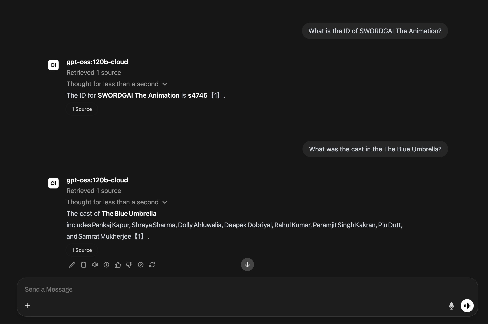
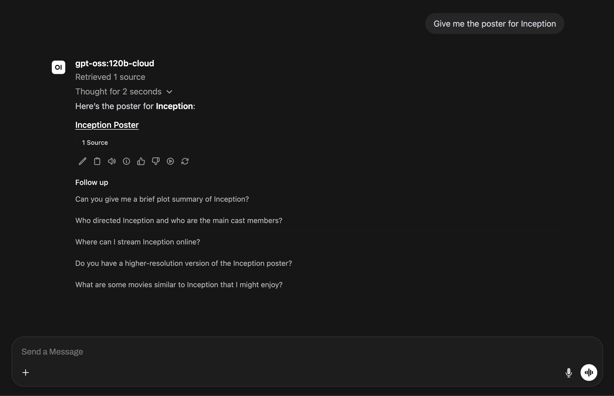
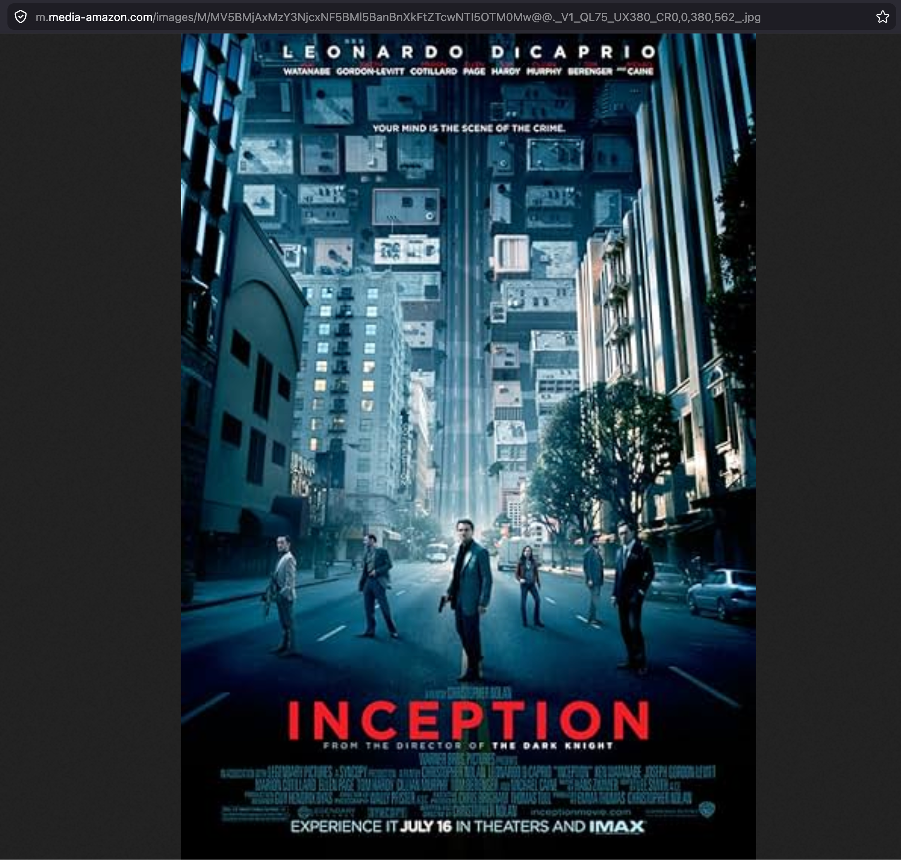

# Netflix + OMDb Open WebUI Integration

Open WebUI chat backed by a **Netflix titles knowledge base** (Kaggle CSV), with a **Flask proxy** to the **OMDb API** and an **Open WebUI filter** that enriches answers with data not in the CSV — poster URL, IMDb rating, and plot.

Built with **Open WebUI**, **Flask**, and **OMDb**.

---

## What we built

1. **Knowledge base** — `data/netflix_titles.csv` uploaded to Open WebUI (title, director, cast, country, rating, duration, etc.).
2. **Flask server** (`tools_server.py`) — local proxy to OMDb; keeps the API key on the host.
3. **Open WebUI filter** (`webui_function.py`) — intercepts movie/show questions, calls the Flask server, injects OMDb data, and appends the poster link to the response.

The CSV has Netflix metadata but **no poster images or IMDb ratings**. The external API fills that gap.

---

## Setup

### Prerequisites

- **Python 3.11+**
- **Open WebUI** (Docker)
- **OMDb API key** from [omdbapi.com](http://www.omdbapi.com/apikey.aspx)

### 1. Install dependencies

```bash
cd 24.06.2026
pip install -r requirements.txt
```

### 2. Create `.env`

```bash
echo 'OMDB_API_KEY=your_key_here' > .env
```

### 3. Start Flask

```bash
python3 tools_server.py
```

Runs on **port 5005** (`http://localhost:5005`).

Verify:

```bash
curl "http://localhost:5005/movie?title=Inception"
```

### 4. Configure Open WebUI

1. Upload `data/netflix_titles.csv` as a **Knowledge Base** and attach it to your chat model.
2. Import `webui_function.py` as a **Filter** (Workspace → Functions).
3. Enable the filter on the same model.

The filter calls Flask from inside Docker at `http://host.docker.internal:5005`.

---

## How it works

```text
User asks about a movie/show
    ↓
Open WebUI Filter (inlet)
    ├── searches Netflix KB (CSV data)
    └── calls Flask GET /movie?title=...
            ↓
        OMDb API (poster, IMDb rating, plot)
    ↓
Filter injects OMDb data + appends poster link (outlet)
    ↓
LLM answer with Netflix + external data
```

---

## Flask API

| Method | Path | Description |
|--------|------|-------------|
| GET | `/health` | Health check |
| GET | `/movie?title=...` | Look up a movie or TV show via OMDb |

---

## Example OMDb response

```json
{
  "title": "Inception",
  "year": "2010",
  "imdb_rating": "8.8",
  "plot": "A thief who steals corporate secrets through dream-sharing technology...",
  "poster": "https://m.media-amazon.com/images/M/..."
}
```

---

## Screenshots

**Knowledge base** — Netflix CSV loaded in Open WebUI.



**Filter in action** — OMDb API call and poster in chat response.





---

## Project structure

```text
24.06.2026/
├── data/
│   └── netflix_titles.csv       # Kaggle Netflix dataset
├── pictures/                    # Screenshots
├── tools_server.py              # Flask → OMDb proxy
├── webui_function.py            # Open WebUI filter
├── requirements.txt
├── .env                         # OMDB_API_KEY (not committed)
└── README.md
```
