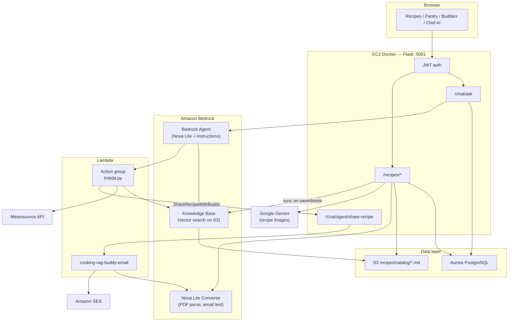
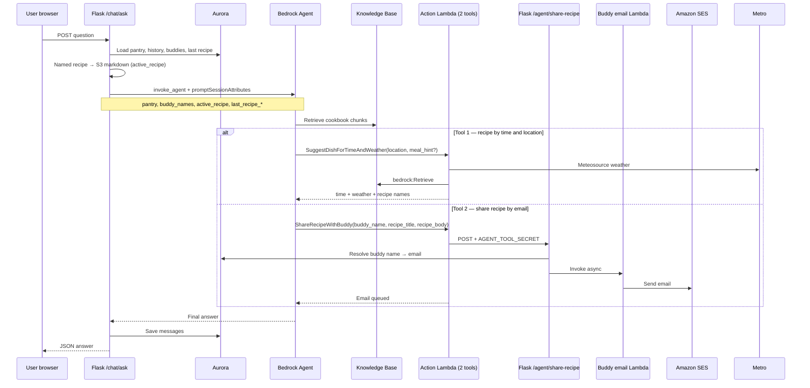
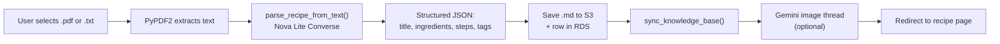

# Smart Cookbook - RAG-Based Culinary Assistant

## Why This Project

Me and my girlfriend always found ourselves opening ChatGPT and asking things
like "what can we make with chicken, rice and onions?" or looking for new
recipes based on whatever we had at home. So when prompted to make a RAG web app
I thought - why not make the topic specifically for help in the kitchen?

So I built a RAG-based cooking assistant where users can upload or save recipe
sources, manage their own recipe collections, and ask natural questions about
meals they can make with the ingredients they already have or about recipes they
have saved / new ones. The app retrieves relevant recipes and cooking
information from its knowledge base and uses an LLM to generate personalized
recipes, suggestions and answers.

---

## Architecture

```
┌─────────────┐   JWT cookie    ┌────────────────────────────────────────────────────────────┐
│   Browser   │ ◄─────────────► │   Flask 3 on EC2 (Docker, port 5001)                       │
│ HTML/CSS/JS │                 │   /auth  /recipes  /chat  /pantry  /buddies                │
└─────────────┘                 └───────┬──────────────────────────────────────────────────┘
                                        │
         ┌──────────────────────────────┼──────────────────────────────┐
         │                              │                              │
┌────────▼─────────┐         ┌──────────▼──────────┐        ┌─────────▼──────────┐
│ Aurora PostgreSQL│         │  Amazon Bedrock       │        │  Amazon S3           │
│ (RDS, IAM auth)  │         │                       │        │  recipes/catalog/    │
│ users, recipes,  │         │  Agent (Chef AI chat) │        │  *.md + images/      │
│ chat, pantry,    │         │  KB (semantic search) │        │  (KB data source)    │
│ buddies          │         │  Nova Lite (Converse) │        └──────────────────────┘
└──────────────────┘         │  - PDF/TXT parsing    │
                             │  - Buddy email body   │        ┌──────────────────────┐
                             └──────────┬────────────┘        │  Google Gemini API   │
                                        │                       │  (recipe photos)     │
                             ┌──────────▼────────────┐        └──────────────────────┘
                             │  Lambda               │
                             │  - Agent action group │◄── Meteosource (weather/time)
                             │  - Buddy email + SES  │
                             └───────────────────────┘

Deployment: Docker on EC2 Ubuntu 24.04 (t3.micro, 20 GB)
            IAM instance role → no AWS credentials in env.ec2
```

### Key Components

| Layer         | Technology                                 | Role                                                         |
| ------------- | ------------------------------------------ | ------------------------------------------------------------ |
| Web framework | Flask 3 + Blueprints                       | Routing, auth, template rendering                            |
| Database      | Aurora PostgreSQL 17 (AWS RDS)             | Users, recipes, conversations, messages, pantry, favorites   |
| DB auth       | IAM token (boto3 `generate_db_auth_token`) | No static passwords — tokens expire in 15 min, cached 14 min  |
| Auth          | PyJWT + bcrypt                             | Stateless JWT tokens in httponly cookies                     |
| Chef AI chat  | Amazon Bedrock **Agent**                   | `/chat/ask` → `invoke_agent` with KB + action Lambda tools |
| RAG / sync    | Bedrock Knowledge Base + `rag/engine.py`   | KB ingestion on upload; `retrieve_chunks()` used by Lambda   |
| LLM (direct)  | Amazon Nova Lite 1.0 (Bedrock Converse)    | PDF/TXT parsing, buddy email composition — not main chat     |
| File storage  | Amazon S3                                  | Recipe markdown + generated images                           |
| Email         | Lambda + Amazon SES                        | Share recipe with cooking buddies                            |
| Images        | Google Gemini (optional)                   | Background food photo after recipe save                      |
| Frontend      | Jinja2 + vanilla JS + marked.js            | Chat UI, recipe CRUD, pantry, dark mode                      |
| Container     | Docker (python:3.11-slim)                  | Reproducible deployment                                      |
| Hosting       | EC2 Ubuntu 24.04 t3.micro                  | IAM instance role provides all AWS credentials               |

### AWS stack diagram

How the browser, Flask, and AWS services connect:



### Chef AI page — how the agent works

Chef AI (`/chat/`) does **not** call Nova Lite directly from Flask. Each message goes through a **Bedrock Agent** you configure in the AWS console.



**Two agent tools (action group / “MCPs”):**

| Tool | When the agent calls it | What it does |
| ---- | ----------------------- | ------------ |
| **SuggestDishForTimeAndWeather** | User asks what to cook by time, weather, or city | Lambda → Meteosource + KB retrieve → recipe names |
| **ShareRecipeWithBuddy** | User asks to email/share a recipe to a buddy | Lambda → Flask `/chat/agent/share-recipe` → buddy email Lambda → SES |

OpenAPI schema: [`docs/agent_action_group_openapi.yaml`](docs/agent_action_group_openapi.yaml)  
Agent instructions (copy-paste): [`docs/bedrock_agent_instructions.md`](docs/bedrock_agent_instructions.md)

**Session memory:** Bedrock keeps its own session via `conversations.agent_session_id`. **Clear history** rotates that ID.

**Share to buddy:** Handled by the **agent** calling `ShareRecipeWithBuddy`. Flask injects `last_recipe_title`, `last_recipe_body`, and `buddy_names` each turn so the agent knows what to send.

### PDF / TXT → app recipe

Upload flow (`POST /recipes/upload`):



1. Flask reads the file (max 10 MB; PDF must have selectable text).
2. **`parse_recipe_from_text()`** sends the first ~4000 characters to **Nova Lite** with a strict extraction prompt (`_PARSE_PROMPT` in `rag/engine.py`) — temperature 0.1 for reliable JSON.
3. On success, the app builds markdown, uploads to `recipes/catalog/{slug}.md`, inserts into RDS, triggers **KB sync**, and optionally generates a Gemini thumbnail in a background thread.

This path is separate from Chef AI chat: upload uses **direct Converse**, not the Bedrock Agent.

### "Add to My Cookbook" button in chat

When the assistant **invents a brand-new recipe** (not one already in the cookbook), the model should append a hidden machine-readable block:

````
```recipe-json
{"title":"…","description":"…","ingredients":[…],"steps":[…],"notes":"…","tags":[…]}
```
````

**Frontend (`static/js/chat.js`):**

1. `extractRecipeJsonBlocks()` strips fenced `recipe-json` from the displayed markdown.
2. If JSON is valid (title + ingredients + steps), a **Add to My Cookbook** button appears.
3. Click → `POST /recipes/from-chat` → saves S3 + RDS + KB sync + optional Gemini image → opens the new recipe in a new tab.

**Important for Bedrock Agent:** Chat uses the agent, not `ask_chef()`. The **`SYSTEM_PROMPT` in `rag/engine.py`** documents the exact `recipe-json` rules for the legacy Converse path. Copy those rules into your **agent instructions** in the Bedrock console so new-recipe replies include the fence; otherwise the button will not appear.

### Why the prompts are structured this way

| Prompt | Where | Purpose |
| ------ | ----- | ------- |
| **`SYSTEM_PROMPT`** (`rag/engine.py`) | Legacy Converse chat + reference for agent instructions | Ground answers in cookbook context; **only** emit `recipe-json` when inventing a new recipe (never when summarising catalog entries) — prevents duplicate saves and bogus "Add to cookbook" buttons |
| **`_PARSE_PROMPT`** | PDF/TXT upload | Force a single JSON object with fixed keys — no markdown fences, no prose — so parsing is deterministic |
| **Agent instructions** (Bedrock console) | Chef AI chat | Route weather/time questions to action Lambda; use KB for cookbook Q&A; list valid buddies from `promptSessionAttributes.buddy_names` |
| **Buddy email Lambda prompt** | `lambda/buddy_email/` | Turn recipe markdown into a friendly email body via Nova Lite before SES sends it |

Grounding rules exist because RAG chunks are excerpts: without "use only authoritative context" instructions, the model merges recipes or invents ingredients. The narrow `recipe-json` rule exists because the UI treats that fence as a **save trigger** — showing it for existing recipes would confuse users with a useless save button.

---

## AWS Setup (one-time, before first deployment)

### 1 - Aurora PostgreSQL

1. Create an **Aurora PostgreSQL** cluster in RDS (Express Create is fine).
   Internet Access Gateway will be enabled automatically, which forces IAM
   database authentication - this is expected.
2. Note your **cluster writer endpoint** - looks like
   `database-1.cluster-<id>.us-east-1.rds.amazonaws.com`. **Use the cluster
   endpoint, not the instance endpoint** - IAM token auth from an EC2 role only
   validates against the cluster endpoint.
3. Apply the schema from your local machine (IAM admin credentials work):

```bash
cd cooking_rag_AWS
export AWS_ACCESS_KEY_ID=...   AWS_SECRET_ACCESS_KEY=...   AWS_REGION=us-east-1

python3 -c "
import boto3, psycopg2, pathlib
HOST = '<your-cluster-endpoint>'
token = boto3.client('rds', region_name='us-east-1').generate_db_auth_token(
    DBHostname=HOST, Port=5432, DBUsername='postgres')
conn = psycopg2.connect(host=HOST, port=5432, dbname='postgres',
    user='postgres', password=token, sslmode='require')
conn.cursor().execute(pathlib.Path('migrations/schema.sql').read_text())
conn.commit(); conn.close()
print('Schema applied!')
"
```

4. Grant the `rds_iam` role to the `postgres` user (connect as above and run
   `GRANT rds_iam TO postgres;`).

### 2 - Amazon S3

1. Create a bucket (e.g. `my-cooking-rag-bucket`).
2. Place your catalog CSV at `data/recipes.csv`.
3. Upload one Markdown file per recipe (recommended for RAG):

```bash
python3 scripts/csv_to_catalog_md.py --wipe-catalog
```

Use `--half --wipe-all-catalog` to rebuild with every other CSV row (~545 recipes) and
save `data/recipes_half.csv`. Recipe cards show a uniform thumbnail from the CSV
`img_src` column via `manifest.json`.

User-created recipes (manual entry, PDF upload, Chef AI save) get an AI-generated
photo in the background via **Google Gemini** (see [Recipe images](#recipe-images-gemini--s3) below).
You can override or remove images for any recipe from the recipe detail page.

This writes `recipes/catalog/{slug}.md` for every CSV row (~1100 files) using the
**recipe name** from the CSV (not the row index), plus `recipes/catalog/manifest.json`
for fast title/tag lookup in the app. Tags come from the CSV `cuisine_path` column.

All recipes — catalog CSV rows and user-created recipes (manual entry, PDF upload,
Chef AI save) — are stored under **`recipes/catalog/{slug}.md`**.

If you previously uploaded catalog files with numeric slugs (`0.md`, `1089.md`), run
with `--wipe-catalog` to remove those legacy files before re-uploading.

To move older user recipes from `recipes/{slug}.md` to the catalog prefix:

```bash
python3 scripts/migrate_recipes_to_catalog.py
```

4. Optional: `python3 scripts/generate_csv_summary.py` uploads a single
   `recipes/recipes-catalog-summary.md` with aggregate stats only. That file is
   **not** a substitute for per-recipe files when you want semantic search.

#### Public read for generated/uploaded images

Generated and uploaded recipe photos are stored at `recipes/catalog/images/{slug}.png`
(or `.jpg` / `.webp`). Add a bucket policy so browsers can load them directly:

```json
{
  "Version": "2012-10-17",
  "Statement": [
    {
      "Sid": "PublicReadRecipeImages",
      "Effect": "Allow",
      "Principal": "*",
      "Action": "s3:GetObject",
      "Resource": "arn:aws:s3:::YOUR_BUCKET_NAME/recipes/catalog/images/*"
    }
  ]
}
```

Replace `YOUR_BUCKET_NAME` with your bucket (e.g. `us-bucket-giora`). If the bucket
uses **BucketOwnerEnforced** (ACLs disabled), the policy alone is enough — the app
falls back without `ACL=public-read` on upload.

### Recipe images (Gemini + S3)

When a user saves a new recipe (manual form, PDF upload, or Chef AI), the app:

1. Saves the recipe immediately and redirects
2. Spawns a background thread that calls Gemini to generate a food photo
3. Uploads the PNG to S3 and stores the public URL in Aurora (`recipe_images` table)

Catalog CSV recipes keep their manifest `img_src` URLs unless you override them.

**Environment variables** (add to `.env` locally and `env.ec2` on EC2 — do not commit
the API key):

```
GEMINI_API_KEY=<your_google_ai_studio_key>
GEMINI_MODEL=gemini-3.1-flash-image
```

If `GEMINI_API_KEY` is missing, recipes still save; no image is generated.

**Managing images:** On any recipe detail page, click **Manage image** to set an external
URL, upload a replacement, or remove the photo (with confirmation). Overrides are stored
in RDS and take precedence over catalog manifest URLs.

Apply the `recipe_images` table from `migrations/schema.sql` if upgrading an existing
database (the `CREATE TABLE IF NOT EXISTS` block is safe to re-run).

### 3 - Amazon Bedrock Knowledge Base

1. In the Bedrock console, **enable model access** for **Amazon Nova Lite 1.0**
   (`amazon.nova-lite-v1:0`).
2. Create a **Knowledge Base** with **one S3 data source** on the `recipes/`
   prefix (covers all `recipes/catalog/*.md` files).
3. Note the **Knowledge Base ID** and **Data Source ID** (short alphanumeric
   strings in the Bedrock console - not the S3 URL).
4. Sync the data source at least once before launching the app.
5. Set `BEDROCK_KB_SYNC_ALL=true` in `.env` / `env.ec2` so the app syncs every
   data source attached to the knowledge base (recommended if `BEDROCK_KB_DS_ID`
   is stale or you have multiple data sources). After rebuilding the catalog with
   `python3 scripts/csv_to_catalog_md.py --half --wipe-all-catalog` (or
   `--wipe-catalog`), trigger one ingestion job — upload any recipe or restart
   the app with sync enabled so Chef AI retrieval stays aligned with S3.

#### Knowledge base sync troubleshooting

| Symptom | Likely cause | Fix |
| ------- | ------------ | --- |
| `Failed to start knowledge base sync` with an AWS error in the alert | Wrong `BEDROCK_KB_ID` / `BEDROCK_KB_DS_ID` in `env.ec2` | Match IDs from the Bedrock console, or set `BEDROCK_KB_SYNC_ALL=true`; rebuild the Docker image after editing `env.ec2` |
| Sync says **already in progress** | A previous ingestion job is still running | Wait 1–3 minutes; the app retries on the next recipe upload or delete |
| Sidebar shows `0 catalog` recipes | Catalog `.md` files not uploaded yet | Run `python3 scripts/csv_to_catalog_md.py --wipe-catalog`, then wait for KB sync |
| Recipe titles show as numbers (`0`, `1089`) | Old upload used CSV row index as title | Re-run `csv_to_catalog_md.py --wipe-catalog` to rebuild with recipe names |
| Sidebar count looks like user recipes only | Old UI showed RDS count as “chunks” | After this update, the sidebar shows `catalog + yours` from S3 and RDS |
| Retrieval works but sync fails | IAM missing `bedrock-agent:StartIngestionJob` | Ensure the EC2 role includes Bedrock agent permissions |

### 3b - Bedrock Agent (Chef AI chat)

Chef AI uses a **Bedrock Agent** with **two action-group tools** (assignment “MCPs”):

1. **`SuggestDishForTimeAndWeather`** — recipe suggestions by time, weather, and location  
2. **`ShareRecipeWithBuddy`** — email a recipe to a cooking buddy  

#### Setup checklist

1. **Attach the cooking Knowledge Base** (`BEDROCK_KB_ID`) to the agent.
2. **Action group** — upload [`docs/agent_action_group_openapi.yaml`](docs/agent_action_group_openapi.yaml) in the Bedrock console (or define the same two `operationId` values manually). Point the executor to your action Lambda.
3. **Deploy action Lambda** — [`lmbda.py`](lmbda.py), handler `dummy_lambda.lambda_handler`:

```bash
chmod +x scripts/deploy_agent_lambda.sh
./scripts/deploy_agent_lambda.sh action_group_quick_start_38hbb-hwq2r
```

4. **Agent instructions** — paste from [`docs/bedrock_agent_instructions.md`](docs/bedrock_agent_instructions.md).
5. Note **Agent ID** and **Alias ID** for `env.ec2`.

Legacy names `GetTime` / `GetWeather` still work in `lmbda.py` and route to the same logic, but the action group should expose the two tools above for the assignment.

#### Action Lambda environment

Deploy [`lmbda.py`](lmbda.py) to the Lambda already wired to your agent action group.

**Important:** In AWS the handler is usually `dummy_lambda.lambda_handler`, not `lmbda.lambda_handler`.
Use the deploy script (packages `lmbda.py` as `dummy_lambda.py`):

```bash
chmod +x scripts/deploy_agent_lambda.sh
./scripts/deploy_agent_lambda.sh action_group_quick_start_38hbb-hwq2r
```

Or manually: copy `lmbda.py` → `dummy_lambda.py`, zip, upload via console or `aws lambda update-function-code`.

```
BEDROCK_KB_ID=<same as Flask>
METEOSOURCE_API_KEY=<your meteosource key>
FLASK_TOOL_URL=http://<your-ec2-public-ip-or-domain>:5001/chat/agent/share-recipe
AGENT_TOOL_SECRET=<same random secret as Flask>
AWS_REGION=us-east-1
```

> **EC2:** `FLASK_TOOL_URL` must be reachable from AWS Lambda (public IP or domain), **not**
> `http://127.0.0.1:5001`. Match `APP_BASE_URL` in Flask `env.ec2`.

Lambda IAM needs `bedrock:Retrieve` on the knowledge base ARN.

#### Flask / EC2 environment

Add to `.env` (local) and `env.ec2` (production):

```
BEDROCK_AGENT_ID=<agent id from console>
BEDROCK_AGENT_ALIAS_ID=<alias id from console>
AGENT_TOOL_SECRET=<shared secret with action Lambda>
APP_BASE_URL=http://<your-ec2-public-ip>:5001
METEOSOURCE_API_KEY=<optional; used by Lambda, not Flask>
```

> **EC2:** Set `APP_BASE_URL` to the URL users (and Lambda) use to reach the app, e.g.
> `http://54.x.x.x:5001`. Rebuild the Docker image after editing `env.ec2`.

EC2 IAM also needs `bedrock:InvokeAgent` on `arn:aws:bedrock:us-east-1:<account>:agent-alias/<agent-id>/<alias-id>`.

Flask passes these **promptSessionAttributes** on every `/chat/ask`:

| Attribute | Purpose |
| --------- | ------- |
| `pantry` | User's pantry ingredients |
| `buddy_names` | Comma-separated cooking buddy names (for ShareRecipeWithBuddy) |
| `active_recipe` | Full S3 markdown when user names a cookbook recipe |
| `last_recipe_title` / `last_recipe_body` | Most recent recipe in chat (for “share this”) |

Share emails flow: **Agent** → action Lambda `ShareRecipeWithBuddy` → `POST /chat/agent/share-recipe` (secured with `AGENT_TOOL_SECRET`) → buddy email Lambda → SES.

#### Verification

| User message | Expected |
| ------------ | -------- |
| What should I cook in Paris right now? | Agent calls **SuggestDishForTimeAndWeather** → KB-grounded dish names |
| Tell me about Agua Fresca | KB + `active_recipe` authoritative markdown from S3 |
| Email that recipe to Sarah | Agent calls **ShareRecipeWithBuddy** → SES email queued |

#### Troubleshooting

| Symptom | Cause | Fix |
| ------- | ----- | --- |
| CloudWatch shows `Unknown function: GetTime` | Old code still deployed on the action Lambda | Run `./scripts/deploy_agent_lambda.sh <function-name>` — local edits to `lmbda.py` do not reach AWS until redeployed |
| "Sorry, I cannot provide the current time" | Agent received `Unknown function: GetTime` from Lambda | Same as above — redeploy Lambda |
| Time works but Paris recipe suggestion fails | Agent calls `GetTime` instead of `GetWeather` / `SuggestDishForTimeAndWeather` | Update **agent instructions**: for recipe suggestions by location, call `GetWeather` or `SuggestDishForTimeAndWeather` with `location=paris` (not `GetTime`) |
| App says "I can only provide the current date and time" but AWS console test works | Stale **Bedrock agent session** — app used `conversation.id` as `sessionId`; failed tool calls stay in agent memory even after Clear history | Fixed: app uses `conversations.agent_session_id` (rotated on clear + new column on upgrade). Restart Flask after deploy, or click **Clear history** once |
| `Bedrock agent returned an empty response` or generic "unable to assist" | Production alias (`GL2MCCRYP2`) still routes to **old version 5** (GetTime/GetWeather only). DRAFT has the correct tools | App auto-retries **`TSTALIASID`** (DRAFT). For production: Bedrock console → **Prepare** agent, then `./scripts/publish_bedrock_agent.sh` to point alias at the new version |
| Share email fails from agent | `FLASK_TOOL_URL` points to localhost or wrong host | Set Lambda env to `http://<ec2-public-ip>:5001/chat/agent/share-recipe`; security group must allow inbound 5001 |
| Agent never calls ShareRecipeWithBuddy | Action group missing function or weak instructions | Upload OpenAPI from `docs/`; paste `docs/bedrock_agent_instructions.md` |
| Lambda `SuggestDishForTimeAndWeather` returns no recipes | Missing `BEDROCK_KB_ID` on action Lambda or missing `bedrock:Retrieve` IAM | Set env var and add retrieve permission on the Lambda role |

**IAM note:** If CloudWatch shows the Lambda executing and returning HTTP 200, IAM is fine for invocation. Admin console access is separate from the IAM user/role your Flask app uses locally (`AWS_ACCESS_KEY_ID` in `.env`) or on EC2 (instance role).

### 4 - IAM role for EC2

```bash
# Create role
aws iam create-role --role-name cooking-rag-ec2-role \
  --assume-role-policy-document '{
    "Version":"2012-10-17",
    "Statement":[{"Effect":"Allow","Principal":{"Service":"ec2.amazonaws.com"},"Action":"sts:AssumeRole"}]
  }'

# Attach managed policies
aws iam attach-role-policy --role-name cooking-rag-ec2-role \
  --policy-arn arn:aws:iam::aws:policy/AmazonBedrockFullAccess
aws iam attach-role-policy --role-name cooking-rag-ec2-role \
  --policy-arn arn:aws:iam::aws:policy/AmazonS3FullAccess
aws iam attach-role-policy --role-name cooking-rag-ec2-role \
  --policy-arn arn:aws:iam::aws:policy/AmazonRDSFullAccess

# Inline policy for IAM DB auth - AmazonRDSFullAccess covers the management
# plane but rds-db:connect is required separately for token-based DB login
ACCOUNT_ID=$(aws sts get-caller-identity --query Account --output text)
aws iam put-role-policy --role-name cooking-rag-ec2-role \
  --policy-name RdsIamConnect \
  --policy-document "{\"Version\":\"2012-10-17\",\"Statement\":[{\"Effect\":\"Allow\",\"Action\":\"rds-db:connect\",\"Resource\":\"arn:aws:rds-db:us-east-1:${ACCOUNT_ID}:dbuser:*/postgres\"}]}"

# Inline policy: invoke Bedrock Agent + buddy email Lambda
aws iam put-role-policy --role-name cooking-rag-ec2-role \
  --policy-name CookingRagBedrockAndLambda \
  --policy-document "{
    \"Version\": \"2012-10-17\",
    \"Statement\": [
      {
        \"Effect\": \"Allow\",
        \"Action\": [\"bedrock:InvokeAgent\", \"bedrock-agent:StartIngestionJob\", \"bedrock-agent:ListIngestionJobs\", \"bedrock-agent:ListDataSources\"],
        \"Resource\": \"*\"
      },
      {
        \"Effect\": \"Allow\",
        \"Action\": \"lambda:InvokeFunction\",
        \"Resource\": \"arn:aws:lambda:us-east-1:${ACCOUNT_ID}:function:cooking-rag-buddy-email\"
      }
    ]
  }"

# Create instance profile
aws iam create-instance-profile --instance-profile-name cooking-rag-ec2-profile
aws iam add-role-to-instance-profile \
  --instance-profile-name cooking-rag-ec2-profile \
  --role-name cooking-rag-ec2-role
```

### 5 - EC2 Security Group

```bash
SG_ID=$(aws ec2 create-security-group \
  --group-name cooking-rag-sg --description "Cooking RAG app" \
  --region us-east-1 --query 'GroupId' --output text)

aws ec2 authorize-security-group-ingress --group-id $SG_ID --protocol tcp --port 22   --cidr 0.0.0.0/0 --region us-east-1
aws ec2 authorize-security-group-ingress --group-id $SG_ID --protocol tcp --port 5001 --cidr 0.0.0.0/0 --region us-east-1
echo "Security group: $SG_ID"
```

### 6 - Cooking Buddies email (optional)

Cooking buddies (name, email, picture URL) are stored in **Aurora PostgreSQL** only.
Profile pictures are external URLs — no S3 upload.

#### Prerequisites

1. Upload the catalog to S3: `python3 scripts/csv_to_catalog_md.py --wipe-catalog`
2. Verify a sender address in **Amazon SES** (`SES_FROM_EMAIL`)
3. Deploy the Lambda in [`lambda/buddy_email/`](lambda/buddy_email/) (see its README)
4. Grant the EC2 role `lambda:InvokeFunction` on the Lambda ARN
5. Add to `env.ec2`:

```
BUDDY_EMAIL_LAMBDA_NAME=cooking-rag-buddy-email
SES_FROM_EMAIL=you@your-verified-domain.com
```

6. Rebuild and redeploy the Docker image

#### Using Share a recipe

1. Add buddies at **/buddies/** (top nav)
2. In the **Share a recipe** section, click **Browse recipes** to pick from the full catalog (search by name or tag)
3. Choose buddies, add an optional personal note, and click **Send recipe email**
4. Bedrock Nova Lite composes the email body; SES delivers it

Recipe detail pages link to `/buddies/?recipe=<slug>` to pre-select a recipe.

#### Troubleshooting

| Issue | Fix |
| ----- | --- |
| Recipe list empty | Run `csv_to_catalog_md.py`; check `S3_BUCKET_NAME` and `recipes/` prefix |
| First search is slow | Normal — the app builds an S3 recipe index once, then caches it for 10 minutes |
| Email fails | Verify recipient in SES sandbox; check Lambda CloudWatch logs at `/aws/lambda/cooking-rag-buddy-email` |
| Email service not configured | Set `BUDDY_EMAIL_LAMBDA_NAME` and `SES_FROM_EMAIL` in `.env` / `env.ec2` and redeploy |

---

## Deploying to EC2 (Ubuntu)

### Step 1 - Create `env.ec2`

Create `env.ec2` in the project root. This is baked into the Docker image and
contains **no AWS credentials** - the EC2 instance role provides those via the
metadata service.

```
SECRET_KEY=<any_long_random_string>
AWS_REGION=us-east-1
BEDROCK_KB_ID=<your_kb_id>
BEDROCK_KB_DS_ID=<your_ds_id>
BEDROCK_KB_SYNC_ALL=true
BEDROCK_AGENT_ID=<your_agent_id>
BEDROCK_AGENT_ALIAS_ID=<your_agent_alias_id>
AGENT_TOOL_SECRET=<shared_secret_with_action_lambda>
APP_BASE_URL=http://<your-ec2-public-ip>:5001
METEOSOURCE_API_KEY=<your_meteosource_key>
# Optional: cooking buddies email via Lambda + SES
BUDDY_EMAIL_LAMBDA_NAME=cooking-rag-buddy-email
SES_FROM_EMAIL=you@your-verified-domain.com
# Optional: AI-generated recipe photos (do not commit the key)
# GEMINI_API_KEY=
# GEMINI_MODEL=gemini-3.1-flash-image
S3_BUCKET_NAME=<your_bucket_name>
S3_RECIPES_PREFIX=recipes/
RDS_HOST=<your_cluster_writer_endpoint>
RDS_PORT=5432
RDS_DB=postgres
RDS_USER=postgres
```

> Use the **cluster writer endpoint** (e.g.
> `database-1.cluster-<id>.us-east-1.rds.amazonaws.com`).
>
> **Before building the image:** replace `<your-ec2-public-ip>` in `APP_BASE_URL`
> with your instance's public IP (or domain). The action Lambda's `FLASK_TOOL_URL`
> must use the same host. Rebuild Docker after any `env.ec2` change.

### Step 2 - Build and push the Docker image

Mac uses Apple Silicon (arm64) but EC2 runs amd64 - cross-compile with buildx:

```bash
docker buildx build \
  --platform linux/amd64 \
  -t <your-dockerhub-username>/cooking-rag:latest \
  --push .
```

You must be logged in (`docker login`) beforehand.

### Step 3 - Launch an Ubuntu EC2 instance

```bash
# Get latest Ubuntu 24.04 LTS AMI (Canonical account: 099720109477)
AMI_ID=$(aws ec2 describe-images \
  --owners 099720109477 \
  --filters \
    "Name=name,Values=ubuntu/images/hvm-ssd-gp3/ubuntu-noble-24.04-amd64-server-*" \
    "Name=state,Values=available" \
  --query 'sort_by(Images,&CreationDate)[-1].ImageId' \
  --output text --region us-east-1)

INSTANCE_ID=$(aws ec2 run-instances \
  --image-id $AMI_ID \
  --instance-type t3.micro \
  --key-name <your-key-pair-name> \
  --security-group-ids <your-sg-id> \
  --iam-instance-profile Name=cooking-rag-ec2-profile \
  --region us-east-1 \
  --block-device-mappings '[{"DeviceName":"/dev/sda1","Ebs":{"VolumeSize":20,"VolumeType":"gp3","DeleteOnTermination":true}}]' \
  --tag-specifications 'ResourceType=instance,Tags=[{Key=Name,Value=cooking-rag}]' \
  --query 'Instances[0].InstanceId' --output text)

echo "Instance: $INSTANCE_ID"
sleep 20
PUBLIC_IP=$(aws ec2 describe-instances --instance-ids $INSTANCE_ID \
  --query 'Reservations[0].Instances[0].PublicIpAddress' --output text)
echo "IP: $PUBLIC_IP"
```

### Step 4 - Install Docker on the instance

SSH in (Ubuntu default user is `ubuntu`, not `ec2-user`):

```bash
ssh -i ~/Downloads/<your-key>.pem ubuntu@<public-ip>
```

Then run:

```bash
# 1. Install prerequisites
sudo apt-get update
sudo apt-get install -y ca-certificates curl

# 2. Add Docker's official GPG key
sudo install -m 0755 -d /etc/apt/keyrings
sudo curl -fsSL https://download.docker.com/linux/ubuntu/gpg \
  -o /etc/apt/keyrings/docker.asc
sudo chmod a+r /etc/apt/keyrings/docker.asc

# 3. Add Docker apt repository
echo \
  "deb [arch=$(dpkg --print-architecture) signed-by=/etc/apt/keyrings/docker.asc] \
  https://download.docker.com/linux/ubuntu \
  $(. /etc/os-release && echo "$VERSION_CODENAME") stable" | \
  sudo tee /etc/apt/sources.list.d/docker.list > /dev/null
sudo apt-get update

# 4. Install Docker
sudo apt-get install -y docker-ce docker-ce-cli containerd.io \
  docker-buildx-plugin docker-compose-plugin

# 5. Verify Docker is running
sudo systemctl status docker
# If not running: sudo systemctl start docker

# 6. (Optional) Log in to Docker Hub to push images from this machine
docker login -u <your-dockerhub-username>
```

### Step 5 - Pull and run the container

```bash
sudo docker pull <your-dockerhub-username>/cooking-rag:latest
sudo docker run -d \
  --restart=always \
  -p 5001:5001 \
  --name cooking-rag \
  <your-dockerhub-username>/cooking-rag:latest
```

> No `--env-file` needed - config is baked into the image via `env.ec2`, and AWS
> credentials come from the instance IAM role automatically.

Wait ~10 seconds then check logs:

```bash
sudo docker logs cooking-rag --tail 20
```

App is live at **http://\<public-ip\>:5001**

### Step 6 - Updating after code changes

```bash
# On your local machine - rebuild and push
docker buildx build --platform linux/amd64 \
  -t <your-dockerhub-username>/cooking-rag:latest --push .

# On EC2 - pull and restart
ssh -i ~/Downloads/<your-key>.pem ubuntu@<public-ip> \
  "sudo docker pull <your-dockerhub-username>/cooking-rag:latest && \
   sudo docker stop cooking-rag && sudo docker rm cooking-rag && \
   sudo docker run -d --restart=always -p 5001:5001 --name cooking-rag \
     <your-dockerhub-username>/cooking-rag:latest"
```

---

## Local Development

### 1. Clone and configure

```bash
git clone <repository-url>
cd cooking_rag_AWS
```

Create `.env` (gitignored - never commit it):

```
SECRET_KEY=any_long_random_string
AWS_REGION=us-east-1
AWS_ACCESS_KEY_ID=<your_iam_user_access_key>
AWS_SECRET_ACCESS_KEY=<your_iam_user_secret_key>
BEDROCK_KB_ID=<your_kb_id>
BEDROCK_KB_DS_ID=<your_ds_id>
BEDROCK_KB_SYNC_ALL=true
BEDROCK_AGENT_ID=<your_agent_id>
BEDROCK_AGENT_ALIAS_ID=<your_agent_alias_id>
AGENT_TOOL_SECRET=<shared_secret_with_action_lambda>
APP_BASE_URL=http://127.0.0.1:5001
METEOSOURCE_API_KEY=<your_meteosource_key>
S3_BUCKET_NAME=<your_bucket_name>
S3_RECIPES_PREFIX=recipes/
RDS_HOST=<your_cluster_writer_endpoint>
RDS_PORT=5432
RDS_DB=postgres
RDS_USER=postgres
GEMINI_API_KEY=<your_google_ai_studio_key>
GEMINI_MODEL=gemini-3.1-flash-image
```

Upload the CSV catalog to S3 before testing RAG search:

```bash
python3 scripts/csv_to_catalog_md.py --wipe-catalog
```

The recipes page supports search by **recipe name or tag** (20 recipes per page).

### 2. Run locally via Docker

```bash
docker build -t cooking-rag .
docker run -p 5001:5001 --env-file .env cooking-rag
```

Open **http://localhost:5001**

### 3. Run without Docker

```bash
python3 -m venv .venv && source .venv/bin/activate
pip install -r requirements.txt
python app.py
```

---

## Project Structure

```
cooking_rag_AWS/
├── app.py                  # Flask app factory, blueprints, error handlers
├── config.py               # All config loaded from .env
├── db.py                   # Aurora connection pool + IAM token cache
├── auth_utils.py           # JWT helpers
├── env.ec2                 # Non-secret config baked into EC2 Docker image
├── requirements.txt
├── Dockerfile
├── .dockerignore
├── migrations/
│   └── schema.sql          # CREATE TABLE IF NOT EXISTS for all tables
├── lmbda.py                # Bedrock Agent action group Lambda (time/weather + share tools)
├── rag/
│   ├── __init__.py
│   └── engine.py           # retrieve_chunks(), ask_chef(), sync_knowledge_base(), get_index_status()
├── routes/
│   ├── __init__.py
│   ├── auth.py
│   ├── chat.py             # invoke_agent chat + /agent/share-recipe tool endpoint
│   ├── recipes.py
│   ├── pantry.py
│   └── buddies.py
├── services/
│   ├── bedrock_agent.py    # invoke_chef_agent() wrapper
│   ├── buddy_share.py      # Share-to-buddy intent before agent runs
│   ├── recipe_lookup.py    # Authoritative S3 recipe context for chat
│   ├── s3_recipes.py       # S3 recipe index + image URL resolution
│   └── recipe_images.py    # Gemini generation, S3 upload, image overrides
├── lambda/
│   └── buddy_email/        # Bedrock + SES email Lambda
├── scripts/
│   ├── csv_to_catalog_md.py      # One .md per CSV row → recipes/catalog/ + manifest
│   ├── migrate_recipes_to_catalog.py  # Move legacy user recipes into catalog/
│   └── generate_csv_summary.py   # Optional aggregate catalog summary only
├── static/                 # CSS + JS
├── templates/              # Jinja2 HTML
└── Pictures/               # Screenshots for documentation
```

---

## Reflection

### What Went Well

- **Full AWS stack migration** - successfully replaced MongoDB, Gemini,
  HuggingFace, and FAISS with Aurora PostgreSQL, Bedrock Nova Lite, Bedrock
  Knowledge Base, and S3 while keeping all app features intact.
- **IAM-based security** - no static credentials anywhere on the server; the EC2
  instance role provides AWS credentials automatically via the metadata service,
  and Aurora uses short-lived IAM tokens (14-min cache) instead of passwords.
- **Cross-platform Docker builds** - identified and solved the Apple Silicon
  arm64 vs EC2 amd64 mismatch using `docker buildx --platform linux/amd64`,
  which is now documented in the deployment guide.
- **Knowledge Base auto-sync** - every recipe upload or deletion triggers a
  Bedrock KB sync (`BEDROCK_KB_SYNC_ALL=true` syncs all data sources). Chef AI
  uses a Bedrock Agent with attached KB, plus Flask-injected authoritative S3
  markdown for named recipes (`recipe_lookup.py`).

### Challenges Encountered During the AWS Refactor

- **Docker platform mismatch** - the container started fine locally (arm64 Mac)
  but crashed silently on EC2 (amd64). The error only appeared in `docker logs`,
  not at pull time. Required rebuilding with
  `docker buildx build --platform linux/amd64`.
- **IAM auth routing - cluster vs instance endpoint** - Aurora's IAM token
  authentication from an EC2 role only validates against the **cluster writer
  endpoint**, not the individual instance endpoint. Using the instance endpoint
  returned "PAM authentication failed" with no further detail, which took
  considerable debugging to trace back to endpoint routing.
- **Missing `rds-db:connect` permission** - `AmazonRDSFullAccess` covers the AWS
  management plane (creating/modifying clusters) but does not grant
  database-level IAM login. A separate inline policy was required. The error
  message from psycopg2 looked identical to a wrong-password error, making it
  non-obvious that the problem was IAM policy, not credentials.

---

## Example Queries and Outputs

- Refer to the pictures provided via email.
